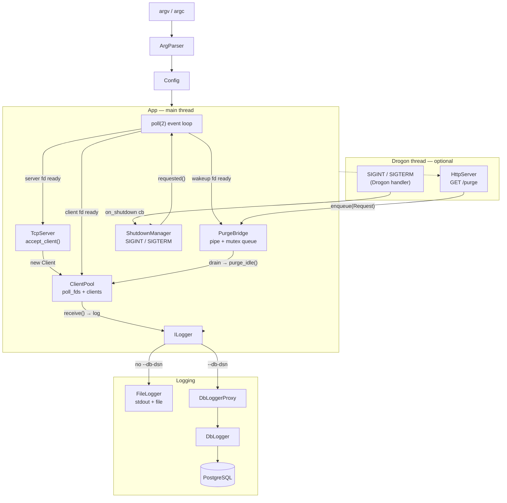

# TCPEchoingServer

A small TCP server (C++) that accepts multiple concurrent clients, prints
received messages to stdout, and appends them to a log file. Optionally exposes
a REST admin endpoint (powered by Drogon) to purge idle connections. Comes with
a helper script, [server.sh](server.sh), to manage it as a background process.

## Build

CMake (C++23 required):

```bash
cmake -B cmake-build-debug && cmake --build cmake-build-debug
```

The resulting binary is `cmake-build-debug/TCPEchoingServer`.

## Running

```bash
./cmake-build-debug/TCPEchoingServer <port> [options]
```

| Flag | Default | Description |
|---|---|---|
| `<port>` (positional) | required | TCP port to listen on |
| `--log-file=<path>` | `./server_msgs.log` | Where received messages are appended |
| `--db-dsn=<conn>` | — | PostgreSQL connection string; enables DB logging |
| `--idle-timeout=<N>` | `600s` | Inactivity threshold for `/purge` (e.g. `30s`, `5m`, `1h`) |
| `--http-port=<port>` | — | Enables the Drogon REST admin server on this port |

The server stops gracefully on `SIGINT` or `SIGTERM`.

## REST Admin API

When `--http-port` is set, a Drogon HTTP server starts on a dedicated thread
and exposes a single endpoint.

### `GET /purge[?threshold=<duration>]`

Disconnects all clients that have been idle longer than `threshold`. Defaults to
`--idle-timeout` when the query param is omitted. The request blocks until the
main event loop processes it.

```bash
curl "http://127.0.0.1:9090/purge"               # use configured idle-timeout
curl "http://127.0.0.1:9090/purge?threshold=30s"  # override threshold
```

Response:

```json
{ "purged": 3 }
```

## Tests

```bash
cmake --build cmake-build-debug --target tests
ctest --test-dir cmake-build-debug --output-on-failure
```

## Managing with `server.sh`

[server.sh](server.sh) wraps start/status/stop as background-process operations.

```bash
# Start in the background; logs lifecycle to ./server.log and prints the PID
./server.sh start ./cmake-build-debug/TCPEchoingServer 8080

# Check status of a running PID (uses `ps`)
./server.sh status <pid>

# Graceful stop: SIGINT first, escalates to SIGTERM if still alive
./server.sh stop <pid>
```

Override the lifecycle log location with `LOG_FILE=/path/to/file ./server.sh start ...`.

## Architecture

Single-threaded, event-driven server using `poll(2)`. An optional Drogon HTTP
server runs on a side thread and communicates with the main loop via a wakeup
pipe (`PurgeBridge`). All production code lives in the `tcp_echo_core` static
library; `main.cpp` is a thin entry point.

`App` member declaration order is load-bearing for construction and destruction:
`cfg_` → `logger_` → `server_` → `shutdown_` → `bridge_` → `pool_` → `http_server_`.

### Component map

| Component | Files | Responsibility |
|---|---|---|
| `Config` | `config/Config.h` | Plain struct: port, log path, poll size, idle timeout, HTTP port |
| `ArgParser` | `config/ArgParser` | Parses argv into `Config`; throws `std::invalid_argument` if port is missing |
| `ILogger` | `app/ILogger.h` | Interface: `info`, `error`, `raw` |
| `FileLogger` | `logging/FileLogger` | Mutex-guarded; writes to stdout/stderr and appends to a log file |
| `DbLogger` | `db/DbLogger` | Writes structured rows to PostgreSQL via libpqxx |
| `DbLoggerProxy` | `logging/DbLoggerProxy` | `ILogger` adapter wrapping `DbLogger` |
| `TcpServer` | `net/TcpServer` | RAII listener: `getaddrinfo`→`bind`→`listen`; `accept_client()` returns `Client` |
| `Client` | `net/Client` | RAII move-only fd wrapper; `receive()` → recv into 256-byte buffer; tracks `last_activity` |
| `ClientPool` | `net/ClientPool` | Parallel `vector<pollfd>` + `vector<Client>`; mark-and-sweep removal; `purge_idle()` |
| `ShutdownManager` | `app/ShutdownManager` | Installs SIGINT/SIGTERM via `sigaction`; single-instance; hooks fire in reverse order on destruction |
| `PurgeBridge` | `app/PurgeBridge` | Thread-safe pipe + queue; Drogon enqueues, main loop drains |
| `HttpServer` | `http/HttpServer` | Wraps Drogon on a dedicated thread; exposes `GET /purge` |
| `App` | `app/App` | Composes all subsystems; owns the `poll(2)` event loop |
| `util::parse_duration` | `util/duration` | Parses `30s` / `5m` / `2h` → `std::chrono::seconds` |

### Diagram



---

### Component details and usage snippets

#### `Config` — plain data struct

```cpp
struct Config {
    uint16_t port;
    std::filesystem::path log_path  = "./server_msgs.log";
    int poll_size                   = 5;
    std::optional<std::string> db_dsn;
    std::chrono::seconds idle_timeout{600};
    std::optional<uint16_t> http_port;
};
```

#### `ArgParser` — command-line parsing

Supports `--key=value`, `--key value`, and positional arguments (keyed `"0"`, `"1"`, …).

```cpp
ArgParser parser(argc, argv);
Config cfg;
parser.apply(cfg);  // throws std::invalid_argument if no port is given
// Recognises: --log-file, --db-dsn, --idle-timeout=30s, --http-port=9090
```

#### `ILogger` / `FileLogger` / `DbLoggerProxy` — logging

`App` selects the implementation at construction: `FileLogger` when no `--db-dsn`
is given, `DbLoggerProxy` otherwise. The rest of the codebase only sees `ILogger`.

```cpp
// FileLogger — stdout/stderr + append to file
std::unique_ptr<ILogger> logger = std::make_unique<FileLogger>(cfg.log_path);
logger->info("server started");  // → stdout + file
logger->error("bind failed");    // → stderr + file
logger->raw(data, n);            // → file only (raw bytes, no newline)

// DbLoggerProxy — wraps DbLogger → PostgreSQL
auto logger = std::make_unique<DbLoggerProxy>(*cfg.db_dsn, "tcp_server");
logger->info("client connected");  // INSERT INTO logs(level, source, message, ...)
```

#### `TcpServer` — RAII TCP listener

```cpp
TcpServer server(cfg.port);               // getaddrinfo → socket → bind → listen
int listening_fd = server.fd();
Client client    = server.accept_client();  // blocks until a client connects
// Destructor closes the listening fd automatically.
```

#### `Client` — RAII move-only fd wrapper

Each `Client` records the timestamp of its last successful `receive()` for idle detection.

```cpp
Client client = server.accept_client();
int n = client.receive();         // recv into a 256-byte internal buffer
if (n > 0) {
    logger->info(client.buffer());
    // client.last_activity() was updated automatically
} else if (n == 0) {
    // peer disconnected — returning false from for_each_ready_client removes it
}
Client moved = std::move(client); // fd is nulled in the moved-from object
```

#### `ClientPool` — `poll(2)` multiplexer

Manages a parallel `vector<pollfd>` and `vector<Client>`. Slot 0 is always the
server fd; slot 1 (when set) is the wakeup fd supplied by `PurgeBridge`.

```cpp
ClientPool pool(server.fd(), cfg.poll_size, bridge.read_fd());
pool.add(std::move(client));
pool.poll(1000 /*ms*/);

if (pool.is_server_ready()) { pool.add(server.accept_client()); }
if (pool.is_wakeup_ready()) { /* drain PurgeBridge below */ }

pool.for_each_ready_client([&](Client& c) -> bool {
    int n = c.receive();
    if (n <= 0) return false;  // false → remove and close
    logger->raw(c.buffer(), n);
    return true;
});

// Called from the main loop after draining PurgeBridge:
size_t removed = pool.purge_idle(cfg.idle_timeout,
                                 std::chrono::steady_clock::now());
```

#### `ShutdownManager` — signal handling

Only one instance may exist at a time (enforced with `compare_exchange_strong`).
The signal handler only sets an `atomic<bool>` (async-signal-safe). Hooks fire
in reverse registration order when the manager is destroyed.

```cpp
ShutdownManager shutdown;
shutdown.register_hook([] { /* cleanup */ });

while (!shutdown.requested()) {
    pool.poll(1000);
    // ...
}
return shutdown.exit_code();
```

#### `PurgeBridge` — cross-thread wakeup

Bridges the Drogon thread to the main event loop without locking the loop. Drogon
calls `enqueue` and returns immediately; the main loop drains and calls `on_complete`
— Drogon's response callback is thread-safe across threads.

```cpp
// Drogon handler thread:
bridge.enqueue({
    .threshold   = std::chrono::seconds(30),
    .on_complete = [cb](size_t purged) {
        Json::Value body;
        body["purged"] = static_cast<Json::UInt64>(purged);
        cb(drogon::HttpResponse::newHttpJsonResponse(body));
    }
});

// Main event loop (when pool.is_wakeup_ready()):
bridge.drain([&](PurgeBridge::Request& req) {
    size_t count = pool.purge_idle(req.threshold,
                                   std::chrono::steady_clock::now());
    req.on_complete(count);
});
```

#### `HttpServer` — Drogon REST admin

Constructed only when `cfg.http_port` has a value. Runs `drogon::app().run()` on
a dedicated `std::thread`. Because Drogon overwrites `ShutdownManager`'s signal
handlers, `on_shutdown` wires both `drogon::app().quit()` and
`shutdown_.request(0)` together so both loops exit cleanly.

```cpp
// Inside App — constructed only when --http-port is provided:
http_server_.emplace(cfg_, bridge_, [this] { shutdown_.request(0); });

// Endpoint registered at construction time:
// GET /purge?threshold=<duration>  →  {"purged": N}

// Destructor joins the thread cleanly:
// ~HttpServer(): drogon::app().quit() + thread_.join()
```

#### `util::parse_duration` — duration string parsing

```cpp
util::parse_duration("30s");  // → std::chrono::seconds(30)
util::parse_duration("5m");   // → std::chrono::seconds(300)
util::parse_duration("2h");   // → std::chrono::seconds(7200)
util::parse_duration("bad");  // throws std::invalid_argument
```
